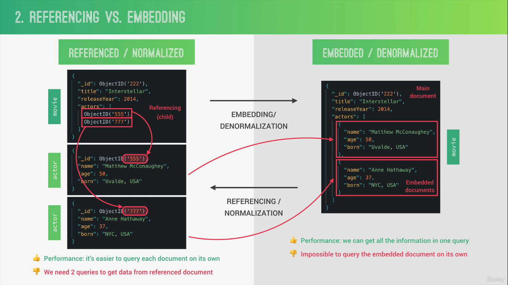
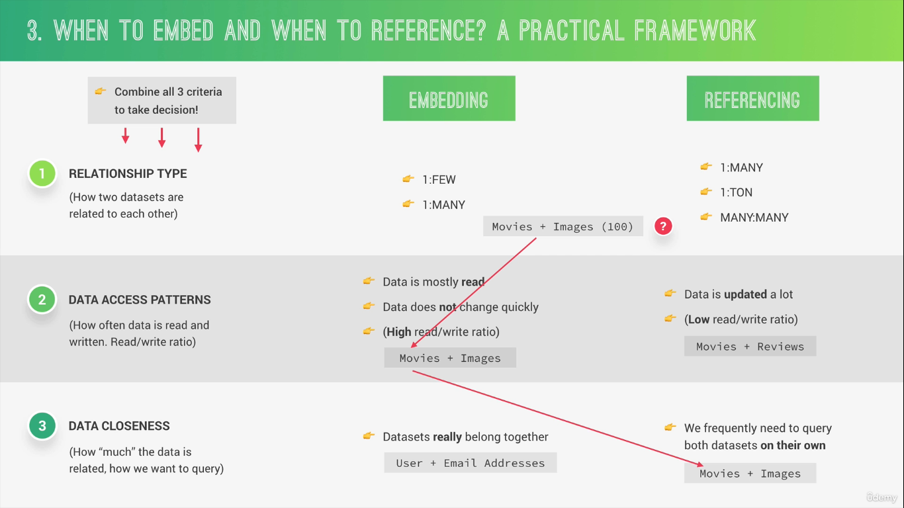
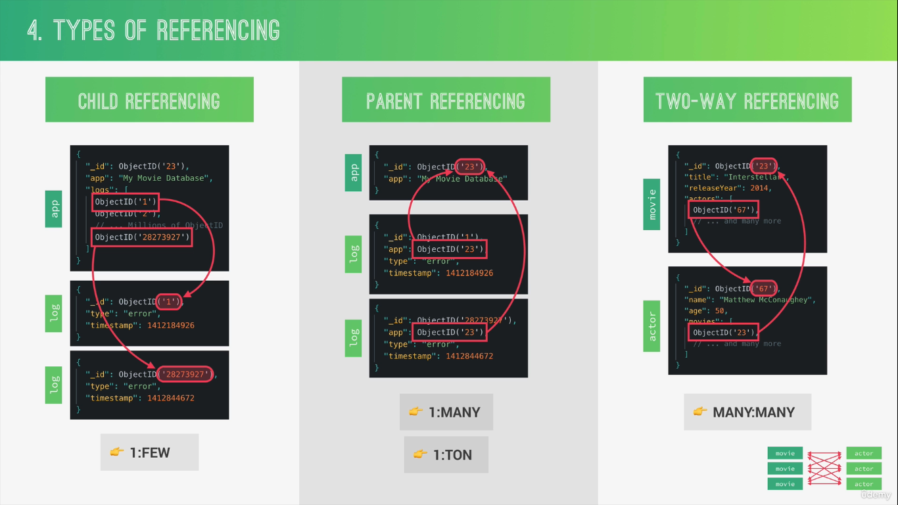
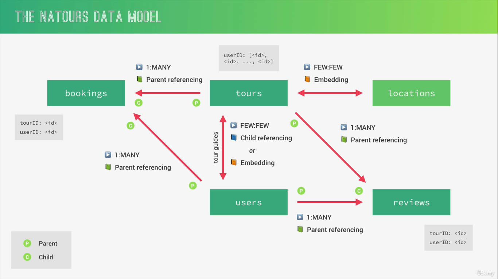

# Data Modeling

Data modeling is the process of organizing data into a logical structure.

> _The maximum size of a single MongoDB document is 16 megabytes (MB)_

## Relationship Types

### One-to-One

One document is related to exactly one other document. _Example: movie &rarr; name : One movie can have only one name._

---

### One-to-Many

One document is related to multiple documents. _Examples: movie &rarr; reviews : One movie can have many reviews._

---

### Many-to-Many

Multiple documents relate to multiple documents. _Examples : Movies ↔ Actors : One movie can have many actors and one actors can act on many movies_

---

## Referencing and Embedding

- 
  - `Embedded` : Will have array of object(Each object will have their own info there) inside of documents. While in `Referencing` : each those embedded will have their own info in separate document.

- 

- 

- 
  - users &rarr; reviews : One user can write many reviews but those review can belong to only one user.

---

## References (`ref`)

`ref` creates a relationship between two collections.

To reference another document:

- Use `Schema.Types.ObjectId` as the field type.
- Set the `ref` option to the model name.

```js
const mongoose = require("mongoose");
const { Schema } = mongoose;

// Author Collection
const authorSchema = new Schema({
  name: String,
});

// Book Collection
const bookSchema = new Schema({
  title: String,
  author: {
    type: Schema.Types.ObjectId,
    ref: "Author",
  },
});

const Author = mongoose.model("Author", authorSchema);
const Book = mongoose.model("Book", bookSchema);

// Create author
const author = await Author.create({
  name: "Jane Austen",
});

// Store author's ObjectId
const book = await Book.create({
  title: "Pride and Prejudice",
  author: author._id,
});

// Populate reference
const bookWithAuthor = await Book.findOne({
  title: "Pride and Prejudice",
}).populate("author");
// we can also get our only desired result like .populate({ path: 'author', select: '-_id' }) shows without author id, use minus sign for this

console.log(bookWithAuthor.author.name);
// Jane Austen
```

### What `populate()` does

Without `populate()`:

```js
{
  title: "Book",
  author: ObjectId("...")
}
```

With `populate()`:

```js
{
  title: "Book",
  author: {
    _id: "...",
    name: "Jane Austen"
  }
}
```

## Virtual Populate

Virtual populate creates relationships **without storing ObjectIds in the parent document**.

Useful when the child already contains the parent's ObjectId.

Example:

```js
userSchema.virtual("posts", {
  ref: "Post",
  localField: "_id",
  foreignField: "user",
});
```
- Useful in a case when parent can have to many embedded items and can grow very large and virtual property let you to keep ref of all child doc on parent doc without persisting those info to the database.  

## More
```js
const reviewSchema = mongoose.Schema({
  review:String,
  rating:{
    type:Number,
    min:1,
    max:5
  }
  user:{
    type:mongoose.Schema.ObjectId,
    ref:'User'
  },
  tour:{
    type: mongoose.Schema.ObjectId,
    ref: 'Tour'
  }
},
{
  toJSON: {virtuals: true},
  toObject: {virtuals: true}
})

// using pre to populate user and tour every time when we query using find method
reviewSchema.pre('/^find/, function(next){
  this.populate({
    path: 'tour',
    select: 'name'
  }).populate({
    path: 'user',
    select: 'name photo'
  })
  next()
})

```

---


```js
// find about this using AI
{
  toJSON: {virtual: true},
  toObject: {virtual :true}
}
```
